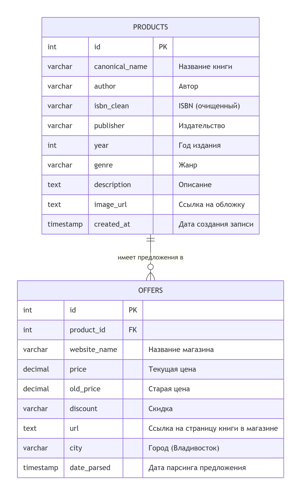
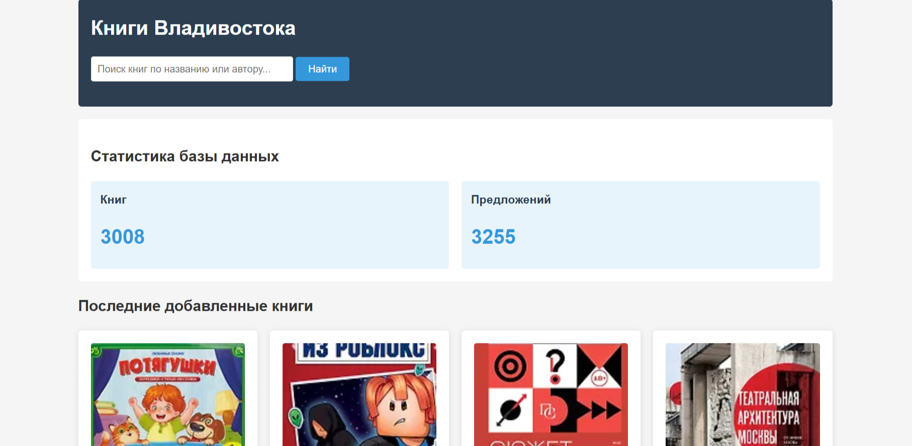
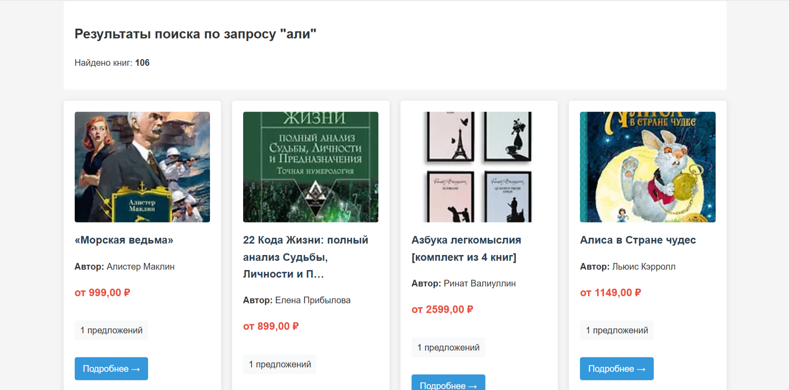
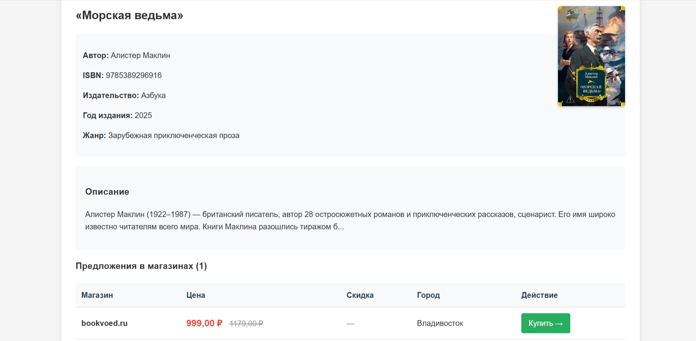

# Проект: Интеграционная база данных книг Владивостока

## Описание проекта
Интеграционная система для сбора, обработки и сравнения данных о книгах из трёх интернет-магазинов Владивостока.

**Цель:** Разработка единой базы данных с веб-интерфейсом для поиска и сравнения книг.

## Архитектура проекта

### 1. Сбор данных (Parsing/)
- **parsers/** - Python-скрипты для парсинга:
  - `parsing.py` - Читай-город (chitai-gorod.ru)
  - `parsing_labirint.py` - Лабиринт (labirint.ru)
  - `parsing_bookvoed.py` - Буквоед (bookvoed.ru)
  - `merge_data.py` - объединение данных из всех источников
  - `import_books.py` - импорт и дедупликация в MySQL
- **data/** - JSON-файлы с сырыми данными
- `books_vladivostok.json` - Читай-город (chitai-gorod.ru)
- `books_labirint.json` - Лабиринт (labirint.ru)
- `books_bookvoed.json` - Буквоед (bookvoed.ru)
- `all_books_raw.json` - объединение полученных данных в общий json файл

### 2. База данных (MySQL)
- Таблица `products` - уникальные книги после дедупликации
- Таблица `offers` - предложения от магазинов с ценами
- Дедупликация по ISBN и названию+автору

### 3. Веб-приложение (django_project/)
- Фреймворк: Django (без ORM, прямое подключение к MySQL)
- Функции:
  - Поиск книг по названию и автору
  - Просмотр детальной информации
  - Сравнение цен между магазинами
- Шаблоны: HTML с CSS

## Установка и запуск

### Требования:
- Python 3.8+
- MySQL Server 8.0+
- Библиотеки: `django`, `mysql-connector-python`, `beautifulsoup4`, `requests`

### Шаг 1: Настройка базы данных
```sql
CREATE DATABASE books_db CHARACTER SET utf8mb4 COLLATE utf8mb4_unicode_ci;
```

### Шаг 2: Установка зависимостей
```
pip install django mysql-connector-python beautifulsoup4 requests
```

### Шаг 3: Сбор данных
```
cd Parsing/parsers
python parsing.py              # Парсинг Читай-город
python parsing_labirint.py     # Парсинг Лабиринт
python parsing_bookvoed.py     # Парсинг Буквоед
python merge_data.py           # Объединение данных
python import_books.py         # Импорт в БД (потребует пароль MySQL)
```

### Шаг 4: Запуск веб-приложения
```
cd django_project
python manage.py runserver
```

## Запуск через Docker

Проект включает готовую Docker-конфигурацию для локального запуска.

### Требования:
- Установленный [Docker](https://www.docker.com/get-started)
- Установленный [Docker Compose](https://docs.docker.com/compose/install/)

### Быстрый старт:

```bash
# 1. Клонировать репозиторий
git clone [URL-вашего-репозитория]
cd django_project

# 2. Запустить проект
docker-compose up

# 3. Открыть в браузере
http://localhost:8000
```

## Структура базы данных


## Функциональность
###  Реализовано:
- Парсинг данных
  - 3 сайта: Читай-город, Лабиринт, Буквоед
  - Собрано по 1000+ книг с каждого сайта
  - Извлечение: название, автор, ISBN, цена, описание
- Дедупликация
  - Приоритет 1: точное совпадение ISBN
  - Приоритет 2: похожее название + автор
  - Очистка и нормализация данных
- Веб-интерфейс
  - Главная страница со статистикой
  - Поиск по названию и автору
  - Детальная страница книги
  - Таблица предложений от магазинов
  - Прямые ссылки для покупки
- База данных
  - Реляционная структура (MySQL)
  - Оптимизированные индексы
  - Эффективные SQL-запросы

## Скриншоты интерфейса
### Главная страница

### Страница поиска

### Детальная страница книги


### Прочая информация
- Проект выполнила Лисицына Алёна Алексеевна, студентка 3 курса
- Преподаватель: Селезнёв Тим Эдуардович
- Курс: Разработка баз данных